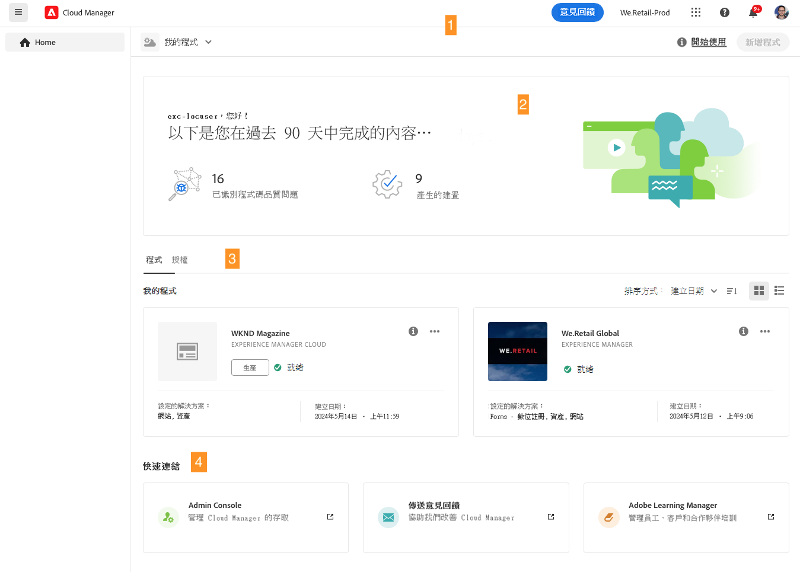
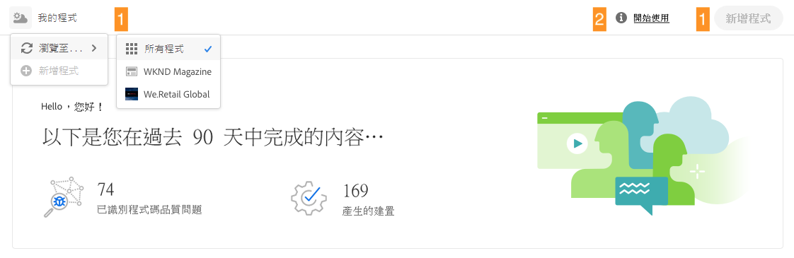
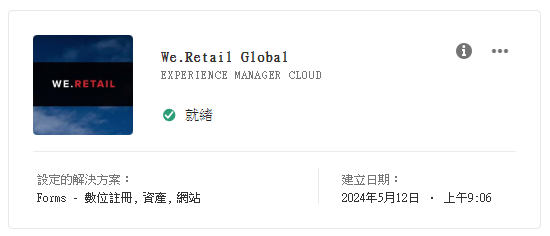
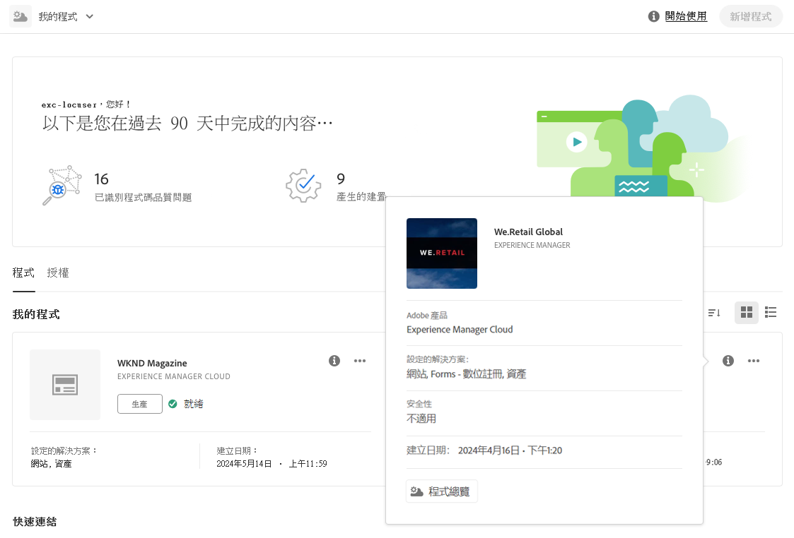
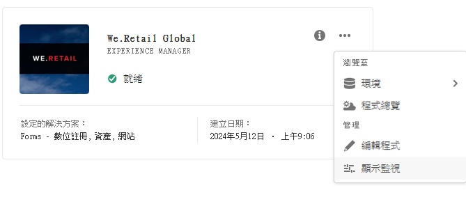
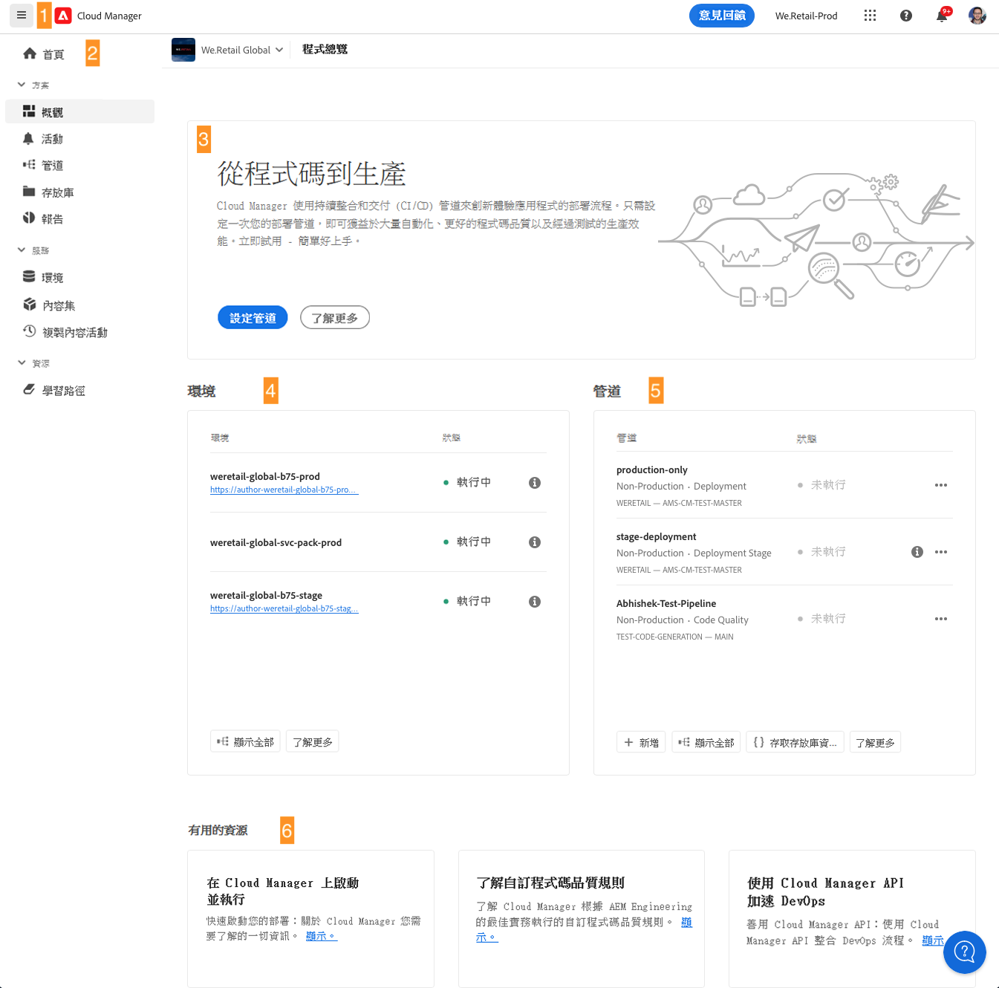
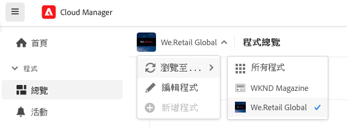
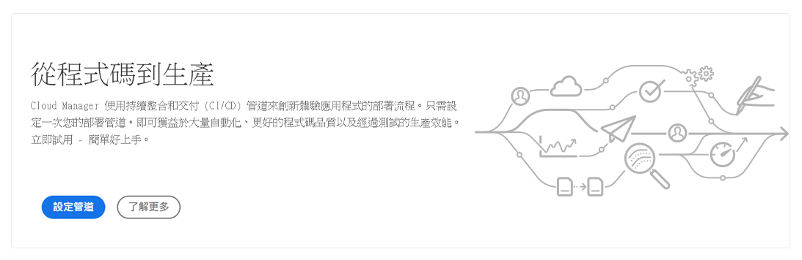

# 導覽 Cloud Manger UI {#navigation}

了解 Cloud Manager UI 的組織方式以及如何導覽此 UI 來管理您的方案和環境。

Cloud Manager UI 主要由兩個圖形介面組成：

* [「我的方案」控制台](#my-programs-console)，您可以在其中檢視和管理所有方案。
* [「方案概觀」視窗](#program-overview)，您可以在其中管理個別方案並查看詳細資訊。

## 「我的方案」控制台 {#my-programs-console}

當您透過 [my.cloudmanager.adobe.com](https://my.cloudmanager.adobe.com/) 登入 Cloud Manager 並選取適當的組織時，您將看到「**我的方案**」控制台。

「我的方案」控制台提供您在所選組織中有權存取之所有方案的概觀。它由幾個部分組成。

1. [工具列](#toolbars-my-programs-toolbars)，用於選擇組織、警示和帳戶設定。
1. 標籤，讓您切換方案的目前視圖。

   * **首頁**&#x200B;視圖 (預設)，選取「**我的方案**」視圖，提供所有方案的概觀。
   * **授權**，用於存取授權儀表板。授權儀表板僅適用於 *AEM as a Cloud Service 方案* (AEMaaCS)，不適用於 AMS 方案。若要確定您的方案所提供的服務類型 (AEMaaCS 或 AMS)，請參閱本文章的[「方案卡片」區段](#program-cards)。
   * 這些標籤預設為關閉狀態，可以使用位於 [Cloud Manager 標頭](#cloud-manager-header)左側的漢堡圖示下拉選單來顯示。

1. [行動號召和統計資料](#cta-statistics)：提供您最近的活動概觀
1. [**我的方案**&#x200B;部份](#my-programs-section)：包含您所有方案的概觀
1. [快速連結](#quick-links)，可輕鬆存取相關資源

>[!TIP]
>
>如需更多方案的詳細資料，請參閱「[方案和方案類型](/help/getting-started/program-setup.md)」。

### 工具列 {#my-programs-toolbars}

有兩個相互重疊的工具列。

#### Cloud Manager 標頭 {#cloud-manager-header}

第一個是 Cloud Manager 標頭。當您瀏覽 Cloud Manager 時標頭會持續顯示。它是一個錨點，可讓您存取適用於 Cloud Manager 方案的設定和資訊。

1. 標頭左側的漢堡圖示為一個下拉式選單，可存取個別方案特定部分的標籤。根據內容，也能讓您在授權儀表板和「**[我的方案](#my-programs-console)**」控制台間切換。
   * 授權儀表板僅適用於 AEM as a Cloud Service 方案，不適用於 AMS 方案。
   * 若要確定您的方案所提供的服務類型 (AMS 或 AEMaaCS)，請參閱本文件的[「方案卡片」區段](#program-cards)。
1. 無論您位於 Cloud Manager 中的哪個位置，Cloud Manager 按鈕皆會將您帶回 Cloud Manager 的「我的方案」控制台。
1. 按一下「意見回饋」按鈕，即可向 Adobe 提供有關 Cloud Manager 的意見回饋。
1. 組織選擇器會顯示您目前所登入的組織 (在本例中為 Foundation Internal)。如果您的 Adobe ID 與多個組織關聯，可按一下以切換到另一個組織。
1. 按一下解決方案切換器，即可快速跳轉到其他 Experience Cloud 解決方案。
1. 使用「說明」圖示可快速存取學習和支援資源。
1. 通知圖示標有目前已指派之未完成的[通知](/help/using/notifications.md)數量
1. 選取代表您使用者的圖示以存取您的使用者設定。如果您沒有選取使用者圖片，則會隨機指派圖示。

#### 方案工具列 {#program-toolbar}

方案工具列提供了在 Cloud Manager 方案與內容相關的動作之間切換的連結。

1. 方案選擇器將會開啟一個下拉式選單，您可以在其中快速選取其他方案或採取內容相關動作，例如建立新方案
1. 透過開始使用連結，您可以存取[上線文件歷程](https://experienceleague.adobe.com/zh-hant/docs/experience-manager-cloud-service/content/onboarding/journey/overview)，幫助您順利設定和執行 Cloud Manager。上線歷程是針對 Adobe Experience Manager as a Cloud Service (AEMaaCS) 上的 Cloud Manager 所設計的，不適用於 Adobe Managed Services (AMS) 上的 Cloud Manager。不過，有許多概念都是相同的。
1. 動作按鈕提供內容相關動作，例如建立新方案。

### 行動號召和統計資料 {#cta-statistics}

「行動號召和統計資料」部份為您的組織提供了彙總資料，例如，如果您已成功設定方案，則可能會顯示過去 90 天內的活動統計資料，包括：

* [部署](/help/using/code-deployment.md)數量
* 已識別的[程式碼品質問題](/help/using/code-quality-testing.md)數量
* 組建數量

或者，如果您剛開始設定您的組織，可能會有關於後續步驟或文件資源的提示。

### 我的方案 {#my-programs-section}

「我的方案」控制台的主要內容為「**我的方案**」區段，該區段會以個別卡片的形式列出您的方案。按一下卡片即可存取該方案的「**方案概觀**」頁面，了解有關該方案的詳細資訊。

>[!NOTE]
>
>依您的權限而定，您可能無法選取某些方案。

使用以下排序選項，讓您可以更順利地找到需要的方案：

* 排序依據
   * 建立日期 (預設)
   * 方案名稱
   * 狀態
* 升序 (預設) / 降序
* 格點檢視 (預設)
* 清單檢視

#### 方案卡片 {#program-cards}

每個方案都以一張卡片或表格中的一列來呈現，提供該方案的概觀以及採取動作的快速連結。

* 方案映像 (若已設定)
* 方案名稱
* 服務類型：
   * 適用於 AMS 方案的 **Experience Manager**
   * 適用於 [AEM as a Cloud Service 方案](https://experienceleague.adobe.com/zh-hant/docs/experience-manager-cloud-service/content/implementing/home)的 **Experience Manager Cloud**
* 狀態
* 設定的解決方案:
* 建立日期

透過資訊圖示，還可以快速存取有關方案的其他資訊 (在清單檢視中很實用)。

透過省略符號圖示，您能存取可對方案執行的其他動作。

* 瀏覽至方案的特定[環境](/help/using/managing-environments.md)
* 開啟[方案概觀](#program-overview)
* [編輯方案](/help/getting-started/program-setup.md)
* 顯示監視

### 快速連結 {#quick-links}

透過快速連結區段，您可以存取實用的相關資源。

## 「方案概觀」視窗 {#program-overview}

在「[**我的方案**」控制台](#my-programs-console)中選取一項方案後，您會進入「**方案概觀**」頁面。

透過「方案概觀」，您可以存取 Cloud Manager 方案的所有詳細資訊。與「我的方案」控制台一樣，它由多個部分組成。

1. [工具列](#program-overview-toolbar)可快速跳回「**我的方案**」控制台並瀏覽方案。
1. [標籤](#program-tabs)可在方案的不同面向間切換。
1. [行動號召](#cta)以方案的最後動作為依據。
1. 方案的[環境概觀](#environments)。
1. 方案的[管道概觀](#pipelines)。
1. [實用資源](#useful-resources)連結。

### 工具列 {#program-overview-toolbar}

「方案概觀」的工具列與[「我的方案」控制台](#my-programs-toolbars)工具列相似。此處圖解僅說明差異部分。

#### Cloud Manager 標頭 {#cloud-manager-header-2}

Cloud Manager 標頭有一個漢堡圖示下拉式選單，會自動開啟以顯示「方案概觀」的可瀏覽標籤。

按一下漢堡圖示即可隱藏標籤。

#### 方案工具列 {#program-toolbar-2}

方案工具列同樣能讓您快速切換到其他方案，而且還可讓您執行內容相關動作，例如新增和編輯方案。

此外，如果您使用漢堡圖示將標籤隱藏，工具列仍然會顯示您目前所在的標籤。

### 方案標籤 {#program-tabs}

每個方案都有許多相關聯的選項和資料。這些資料會收集到索引標籤中，以方便導覽方案。這些索引標籤可讓您存取：

* 概觀 - 目前文件中所述的方案概觀
* [活動](/help/using/managing-pipelines.md#activity) - 方案的管道執行歷史記錄
* [管道](/help/using/managing-pipelines.md#pipelines) - 為方案設定的所有管道
* [存放庫](/help/managing-code/managing-repositories.md) - 為方案設定的所有存放庫
* [報告](/help/using/monitoring-environments.md#system-monitoring-overview) - SLA 資料等量度
* [環境](/help/using/managing-environments.md) - 為方案設定的所有環境
* [內容集](/help/using/content-copy.md) - 為複製目的而建立的內容集合
* [複製內容活動](/help/using/content-copy.md) - 內容複製活動
* 學習路徑 - 有關 Cloud Manager 的其他學習資源

預設情況下，當您開啟方案時，您會到達「**概觀**」索引標籤。會醒目提示目前的索引標籤。選取另一個索引標籤即可顯示其詳細資訊。

使用 [Cloud Manager 標頭](#cloud-manager-header-2)中的漢堡圖示可隱藏標籤。

### 行動號召 {#cta}

行動號召區段會根據您的方案狀態為您提供有用的資訊。對於新方案，您可能會看到建議後續步驟和上線日期提醒，[均於方案建立期間設定](/help/getting-started/program-setup.md)。

對於即時方案，會看到上次部署的狀態以及詳細資訊和開始新部署的連結。

### 環境卡片 {#environments}

「**環境**」卡片為您提供環境的概觀和快速動作的連結。

「**環境**」卡片只會列出三個環境。按一下「**全部顯示**」按鈕即可查看方案的所有環境。

請參閱「[管理環境](/help/using/managing-environments.md)」，了解有關如何管理環境的詳細資訊。

### 管道資訊卡 {#pipelines}

「**管道**」卡片為您提供管道的概觀和快速動作的連結。

「**管道**」卡片只列出了三個管道。按一下「**全部顯示**」按鈕即可查看方案的所有管道。

請參閱「[管理管道](/help/using/managing-pipelines.md)」，了解有關如何管理管道的詳細資訊。

### 實用資源 {#useful-resources}

「**實用資源**」區段提供 Cloud Manager 的其他學習資源連結。
