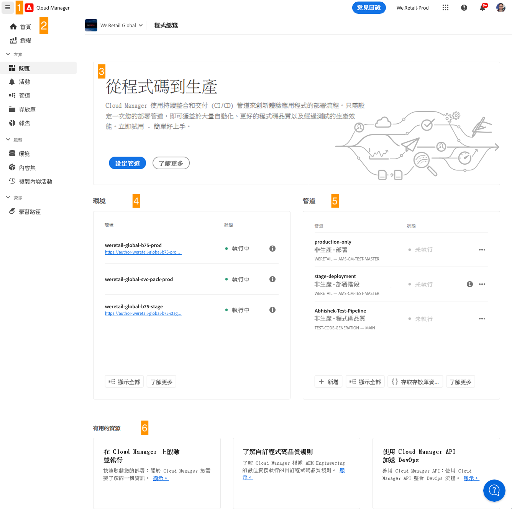

# 導覽 Cloud Manager UI {#navigation}

了解 Cloud Manager UI 的組織方式以及如何導覽以管理您的程式和環境。

Cloud Manager UI 主要由兩個圖形介面組成：

* [「我的程式」主控台](#my-programs-console)是您檢視和管理所有程式的位置。
* [計畫總覽視窗](#program-overview)是您能檢視詳細資訊並管理個別計畫的地方。

## 我的程式主控台 {#my-programs-console}

當您透過 [my.cloudmanager.adobe.com](https://my.cloudmanager.adobe.com/) 登入 Cloud Manager 並選取適當的組織時，您將看到「**我的程式**」控制台。

「我的程式」控制台提供您在所選組織中有權存取之所有程式的概觀。它由幾個部分組成。

1. [工具列](#toolbars-my-programs-toolbars)用於組織選擇、警示和帳戶設定。
1. 可讓您切換程式目前檢視的標籤。

   * **首頁**&#x200B;檢視（預設），此檢視選取&#x200B;**我的計畫**&#x200B;檢視，並包含所有計畫的概覽。
   * **授權**：用於存取授權儀表板授權儀表板僅適用於&#x200B;*AEM as a Cloud Service計畫* (AEMaaCS)，不適用於AMS計畫。 若要判斷您的程式具有的服務型別（AEMaaCS或AMS），請參閱本文的[程式卡片區段](#program-cards)。
   * 索引標籤預設為關閉，並使用位於[Cloud Manager標題](#cloud-manager-header)左側的漢堡圖示下拉式功能表顯示。

1. [行動號召和統計資料](#cta-statistics)：提供您最近的活動概觀
1. [**我的程式**&#x200B;區段](#my-programs-section)：包含您所有程式的概觀
1. [快速連結](#quick-links)以輕鬆存取相關資源

>[!TIP]
>
>如需有關計畫的詳細資訊，請參閱[計畫和計畫型別](/help/getting-started/program-setup.md)。

### 工具列 {#my-programs-toolbars}

有兩個相互重疊的工具列。

#### Cloud Manager標題 {#cloud-manager-header}

第一個是Cloud Manager標頭。 導覽Cloud Manager時，標題會持續保留。 它是一個錨點，可讓您存取適用於 Cloud Manager 程式的設定和資訊。

1. 標題左側的漢堡圖示是下拉式功能表，可讓您存取個別程式特定部分的索引標籤。 視內容而定，它也可讓您在[授權儀表板]與&#x200B;**[我的程式](#my-programs-console)**&#x200B;主控台之間切換。
   * 授權儀表板僅適用於AEM as a Cloud Service計畫，而不適用於AMS計畫。
   * 若要判斷您的程式具有的服務型別（AMS或AEMaaCS），請參閱本檔案的[程式卡片區段](#program-cards)。
1. 無論您在Cloud Manager中的哪個位置，Cloud Manager按鈕都會將您帶回Cloud Manager的「我的程式」主控台。
1. 按一下「意見回饋」按鈕，向Adobe提供有關Cloud Manager的意見回饋。
1. 組織選擇器會顯示您目前登入的組織（在此範例中為Foundation Internal）。 如果您的Adobe ID與多個組織相關聯，請按一下以切換至其他組織。
1. 按一下解決方案切換器可讓您快速跳至其他Experience Cloud解決方案。
1. 「說明」圖示可讓您快速存取學習與支援資源。
1. 通知圖示具有目前指派的未完成[通知](/help/using/notifications.md)數目
1. 選取代表您使用者的圖示以存取您的使用者設定。如果您未選取使用者圖片，則會隨機指派圖示。

#### 程式工具列 {#program-toolbar}

程式工具列提供了在 Cloud Manager 程式與內容相關的動作之間切換的連結。

1. 程式選擇器將會開啟一個下拉式選單，您可以在其中快速選取其他程式或採取內容相關動作，例如建立新程式
1. 快速入門連結可讓您存取[入門檔案歷程](https://experienceleague.adobe.com/zh-hant/docs/experience-manager-cloud-service/content/onboarding/journey/overview)，以開始使用Cloud Manager。
入門歷程是為Adobe Experience Manager as a Cloud Service (AEMaaCS)上的Cloud Manager而設計，而不是AdobeManaged Services (AMS)上的Cloud Manager而設計。 不過，許多概念是相同的。
1. 動作按鈕提供內容相關動作，例如建立新程式。

### 行動號召與統計資料 {#cta-statistics}

「行動號召和統計資料」區段為您的組織提供了彙總資料，例如，如果您已成功設定程式，則可能會顯示過去 90 天內的活動統計資料，包括：

* [部署](/help/using/code-deployment.md)數量
* 已識別的[程式碼品質問題](/help/using/code-quality-testing.md)數量
* 組建數量

或者，如果您剛開始設定您的組織，可能會有關於後續步驟或文件資源的提示。

### 我的程式 {#my-programs-section}

「我的程式」控制台的主要內容是「**我的程式**」區段，該區段會以個別卡片的形式列出您的程式。按一下卡片以存取方案的&#x200B;**方案總覽**&#x200B;頁面，瞭解有關方案的詳細資訊。

>[!NOTE]
>
>根據您的許可權，您可能無法選取某些程式。

請使用下列排序選項，以便找到您需要的程式：

* 排序依據
   * 建立日期 (預設)
   * 程式名稱
   * 狀態
* 升序 (預設) / 降序
* 格點檢視 (預設)
* 清單檢視

#### 程式卡 {#program-cards}

表格中的卡片或列代表每個方案，提供方案概覽和動作快速連結。

* 程式映像 (若已設定)
* 程式名稱
* 服務類型：
   * 適用於 AMS 程式的 **Experience Manager**
   * 適用於 [AEM as a Cloud Service 程式](https://experienceleague.adobe.com/zh-hant/docs/experience-manager-cloud-service/content/implementing/home)的 **Experience Manager Cloud**
* 狀態
* 設定的解決方案:
* 建立日期

透過資訊圖示，還可以快速存取有關程式的其他資訊 (在清單檢視中很實用)。

省略符號圖示可讓您存取可以對方案執行的其他動作。

* 瀏覽至程式的特定[環境](/help/using/managing-environments.md)
* 開啟[程式概觀](#program-overview)
* [編輯程式](/help/getting-started/program-setup.md)
* 顯示監視

### 快速連結 {#quick-links}

快速連結區段可讓您存取實用的相關資源。

## 計畫總覽視窗 {#program-overview}

在&#x200B;[**我的程式**&#x200B;主控台](#my-programs-console)中選取一個程式，會帶您前往&#x200B;**程式總覽**&#x200B;頁面。

計畫概觀可讓您存取Cloud Manager計畫的所有詳細資訊。 與「我的程式」控制台一樣，它由多個部分組成。

1. [工具列](#program-overview-toolbar)可快速跳回&#x200B;**我的程式**&#x200B;主控台，並導覽程式。
1. [索引標籤](#program-tabs)可在程式的不同方面之間切換。
1. 根據程式最後動作的[行動號召](#cta)。
1. 計畫環境](#environments)的[總覽。
1. 計畫的管道](#pipelines)的[總覽。
1. 連結至[有用的資源](#useful-resources)。

### 工具列 {#program-overview-toolbar}

程式總覽的工具列與[我的程式主控台](#my-programs-toolbars)的工具列類似。 此處僅說明差異。

#### Cloud Manager標題 {#cloud-manager-header-2}

Cloud Manager標題有一個漢堡圖示的下拉式選單，會自動開啟以顯示計畫總覽的可導覽標籤。

按一下漢堡圖示以隱藏標籤。

#### 程式工具列 {#program-toolbar-2}

程式工具列仍可讓您快速切換到其他程式，但也可存取與內容相關的動作，例如新增和編輯程式。

此外，如果您使用漢堡圖示隱藏標籤，工具列仍會顯示您目前所在的標籤。

### 計畫標籤 {#program-tabs}

每個方案都有許多相關的選項和資料。 這些資料會收集到索引標籤中，以方便導覽程式。這些索引標籤可讓您存取：

* 概觀 - 目前文件中所述的程式概觀
* [活動](/help/using/managing-pipelines.md#activity) - 程式的管道執行歷史記錄
* [管道](/help/using/managing-pipelines.md#pipelines) - 為程式設定的所有管道
* [存放庫](/help/managing-code/managing-repositories.md) - 為程式設定的所有存放庫
* [報告](/help/using/monitoring-environments.md#system-monitoring-overview) - SLA 資料等量度
* [環境](/help/using/managing-environments.md) - 為程式設定的所有環境
* [內容集](/help/using/content-copy.md) - 為複製目的而建立的內容集合
* [複製內容活動](/help/using/content-copy.md) - 內容複製活動
* 學習路徑 - 有關 Cloud Manager 的其他學習資源

預設情況下，當您開啟程式時，您會到達「**概觀**」索引標籤。會醒目提示目前的索引標籤。選取另一個索引標籤即可顯示其詳細資訊。

使用[Cloud Manager標題](#cloud-manager-header-2)中的漢堡圖示來隱藏標籤。

### 行動號召 {#cta}

號召性用語區段會根據您的方案狀態，提供您有用的資訊。 若是新計畫，您可能會看到提供的後續步驟以及上線日期提醒，[設定於計畫建立期間](/help/getting-started/program-setup.md)。

對於即時程式，會看到上次部署的狀態以及詳細資訊和開始新部署的連結。

### 環境卡 {#environments}

**環境**&#x200B;卡會提供您環境的概觀，以及快速動作的連結。

「**環境**」卡片只會列出三個環境。按一下「**全部顯示**」按鈕即可查看程式的所有環境。

如需有關如何管理環境的詳細資訊，請參閱[管理環境](/help/using/managing-environments.md)。

### 管道卡 {#pipelines}

**管道**&#x200B;卡提供您管道概觀和快速動作連結。

「**管道**」卡片只列出了三個管道。按一下「**全部顯示**」按鈕即可查看程式的所有管道。

如需有關如何管理管道的詳細資訊，請參閱[管理管道](/help/using/managing-pipelines.md)。

### 有用的資源 {#useful-resources}

**實用資源**&#x200B;區段提供Cloud Manager其他學習資源的連結。
