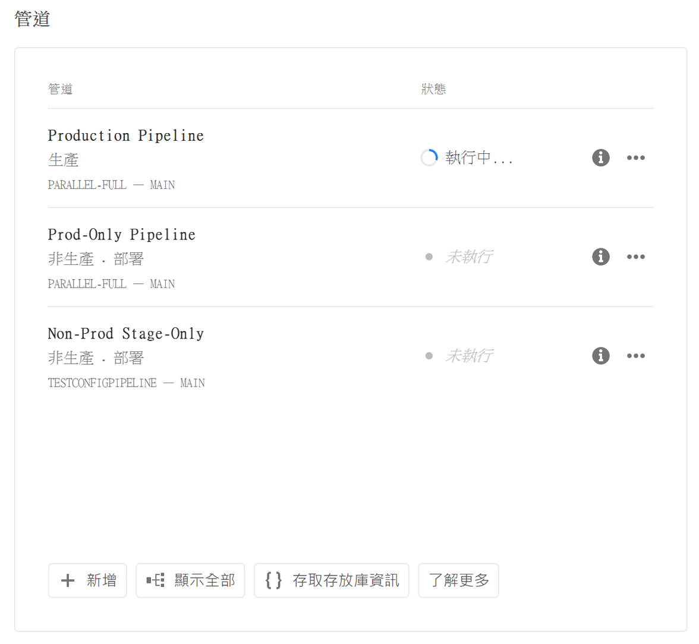
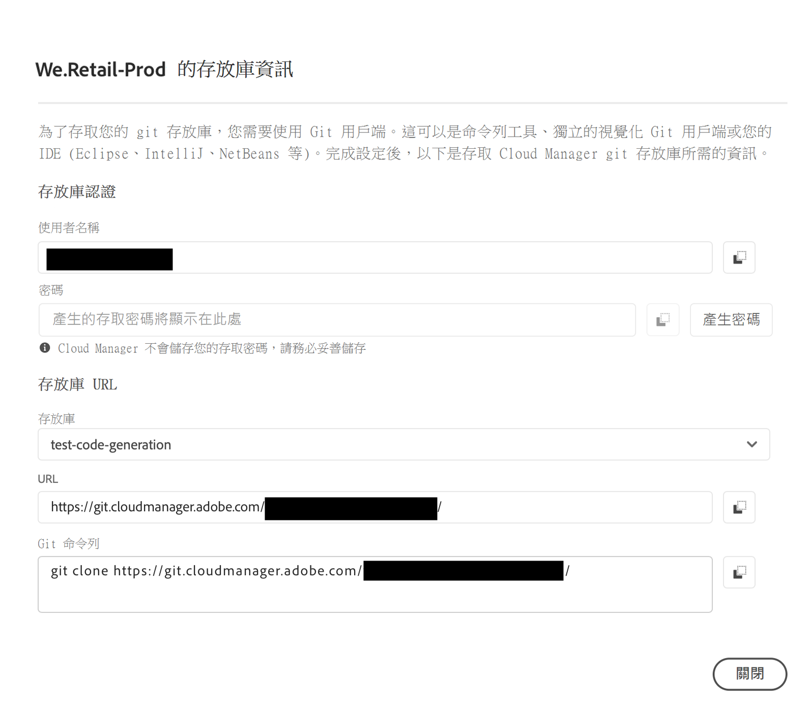
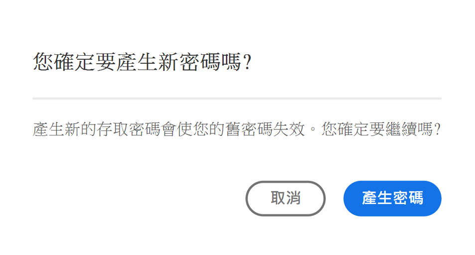
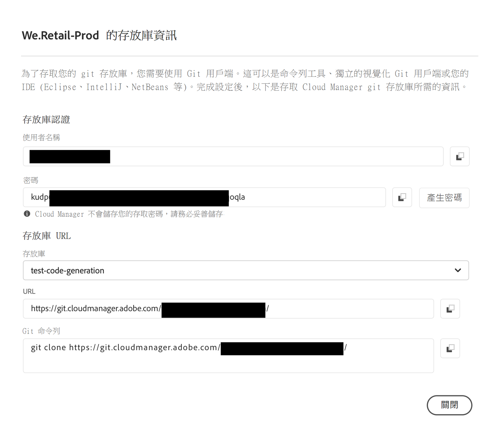

# 存放庫存取資訊 {#accessing-repos}

瞭解如何使用Cloud Manager中的自助Git帳戶管理存取及管理Adobe管理的Git存放庫。

## 從概觀頁面存取存放庫資訊 {#overview-page}

1. 在 [my.cloudmanager.adobe.com](https://my.cloudmanager.adobe.com/) 登入 Cloud Manager 並選取適當的組織和方案。

1. 瀏覽至「**管道**」卡片 (在「**方案概觀**」頁面)。

   

1. 按一下「**存取存放庫資訊**」。在「**...的存放庫資訊**」對話框中，您可以檢視以下內容：

   * Git 使用者名稱。
   * Git 密碼。
   * Cloud Manager Git 存放庫的 URL。
   * 預先建立的Git命令，可快速將遠端新增至您的Git存放庫並推送程式碼。

   

1. 若要存取密碼，必須產生新密碼。按一下「**`Generate password`**」。

1. 在「**您確定...**」對話框中按一下「**產生密碼**」，確認產生密碼。

   

1. 在「**密碼**」欄位中，密碼已產生。按一下複製圖示將其複製到剪貼簿。

   * 產生密碼後，先前的密碼便會失效。
   * Cloud Manager 不會儲存您的存取密碼。請務必將這個密碼儲存在安全的地方。
   * 如果您遺失密碼，則必須產生一個新密碼。

   

若使用這些憑證，您可以複製存放庫的本機副本，並在該本機存放庫中進行變更，且在準備好後可以將任何程式碼變更提交回 Cloud Manager 中的遠端程式碼存放庫。

>[!NOTE]
>
>* 可看見「**存取存放庫資訊**」選項的使用者，具備&#x200B;**開發人員**&#x200B;或&#x200B;**部署管理員**&#x200B;角色，或兩者兼具。
>* 「**Access 存放庫資訊**」按鈕只會顯示 Adob&#x200B;&#x200B;e 託管存放庫的存放庫存取資訊。Cloud Manager 不會提供[私人存放庫](private-repositories.md) 的存取資訊。

## 從存放庫視窗存取存放庫資訊 {#repositories-window}

「**存取存放庫資訊**」按鈕也會出現在「[**存放庫**」視窗](managing-repositories.md)的工具列上。此按鈕顯示有關存取受 Adobe 管理的存放庫的相同資訊。

## 撤銷存取密碼 {#revoke-password}

您可以隨時撤銷存取密碼。[為此類請求建立支援服務單](https://experienceleague.adobe.com/?support-solution=Experience+Manager&amp;support-tab=home#support)。

此服務單會以高優先性處理，且一般會在一天內撤銷。
