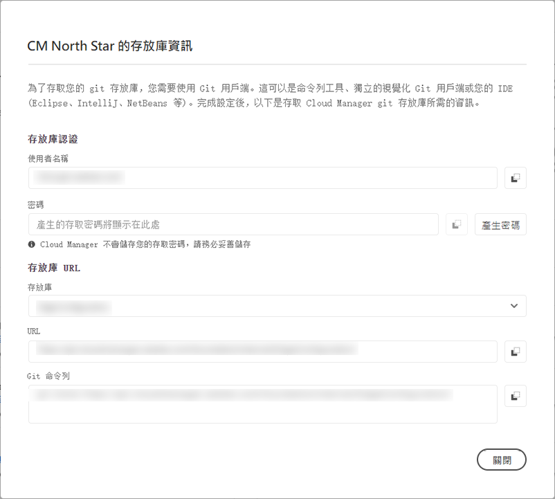

# 存放庫存取資訊 {#accessing-repos}

了解如何使用 Cloud Manager 中的自助 Git 帳戶管理來存取和管理受 Adobe 管理的 Git 存放庫。

## 從概觀頁面存取存放庫資訊 {#overview-page}

Cloud Manager可讓您使用&#x200B;**管道**&#x200B;卡片中的&#x200B;**存取存放庫資訊**，輕鬆擷取Adobe管理存放庫的存放庫存取資訊。

**存放庫資訊**&#x200B;對話方塊可讓您檢視Adobe管理的存放庫的下列存取資訊：

* Git 使用者名稱。
* Git 密碼。
* Cloud Manager Git 存放庫的 URL。
* 預先建立的 Git 指令，可快速新增遠端連線至 Git 存放庫並推送程式碼。

Cloud Manager 不會提供[私人存放庫](/help/managing-code/private-repositories.md) 的存取資訊。

擁有&#x200B;**開發人員**&#x200B;或&#x200B;**部署管理員**&#x200B;角色的使用者看得見&#x200B;**存取存放庫資訊**&#x200B;功能。

**若要從總覽頁面存取存放庫資訊：**

1. 在 [my.cloudmanager.adobe.com](https://my.cloudmanager.adobe.com/) 登入 Cloud Manager 並選取適當的組織和方案。

1. 從&#x200B;**方案總覽**&#x200B;頁面，在&#x200B;**管道**&#x200B;卡下，按一下&#x200B;**存取存放庫資訊**。

   

1. 若要存取密碼，必須產生新密碼。在&#x200B;**存放庫資訊**&#x200B;對話方塊中，選取&#x200B;**產生密碼**。

1. 在確認對話方塊中，選取&#x200B;**產生密碼**。

1. 在&#x200B;**密碼**&#x200B;欄位的右側，按一下以將密碼複製到剪貼簿。

   * 產生密碼後，先前的密碼便會失效。
   * Cloud Manager不會儲存密碼。 您有責任安全地儲存密碼。
   * 由於Cloud Manager不會儲存密碼，因此如果您遺失密碼，則必須重新產生新密碼。

   

若使用這些憑證，您可以複製存放庫的本機副本，並在該本機存放庫中進行變更，且在準備好後可以將任何程式碼變更提交回 Cloud Manager 中的遠端程式碼存放庫。

## 從存放庫視窗存取存放庫資訊 {#repositories-window}

**存取存放庫資訊**&#x200B;功能也可從&#x200B;[**存放庫**&#x200B;頁面](/help/managing-code/managing-repositories.md)使用。 此按鈕顯示有關存取受 Adobe 管理的存放庫的相同資訊。

## 撤銷存取密碼 {#revoke-password}

您可以隨時撤銷存取密碼。

若要這麼做，[為此要求](https://experienceleague.adobe.com/?support-solution=Experience+Manager&amp;support-tab=home#support)建立支援票證。 票證會被視為高優先順序，通常在一天內被撤銷。
