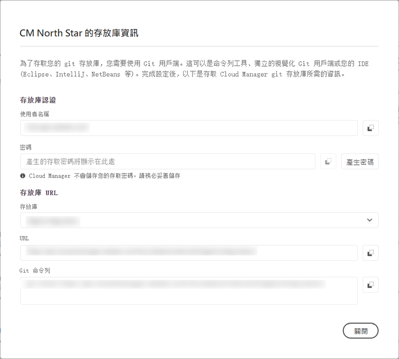

# 存放庫存取資訊 {#accessing-repos}

了解如何使用 Cloud Manager 中的自助 Git 帳戶管理來存取和管理受 Adobe 管理的 Git 存放庫。

## 從概觀頁面存取存放庫資訊 {#overview-page}

透過Cloud Manager，您可以使用&#x200B;**管道**&#x200B;卡片中的&#x200B;**存取存放庫資訊**，擷取Adobe管理的存放庫存取資訊。

透過&#x200B;**存放庫資訊**&#x200B;對話框，您可以查看 Adobe 託管存放庫的以下存取資訊：

* Git 使用者名稱。
* Git 密碼。
* Cloud Manager Git 存放庫的 URL。
* 預先建立的Git命令，可將遠端新增到您的Git存放庫和推送程式碼。

  

Cloud Manager 不會提供[私人存放庫](/help/managing-code/private-repositories.md)的存取資訊。

擁有&#x200B;**開發人員**&#x200B;或&#x200B;**部署管理員**&#x200B;角色的使用者可看見該&#x200B;**存取存放庫資訊**&#x200B;功能。

**若要從概觀頁面存取存放庫資訊：**

1. 在 [my.cloudmanager.adobe.com](https://my.cloudmanager.adobe.com/) 登入 Cloud Manager 並選取適當的組織和方案。

1. 在&#x200B;**計畫概觀**&#x200B;頁面 (位於&#x200B;**管道**&#x200B;卡片下面)，按一下「**存取存放庫資訊**」。

   

1. 若要存取密碼，您必須產生新密碼。 在&#x200B;**存放庫資訊**&#x200B;對話框中，選取「**產生密碼**」。

1. 在確認對話框中，選取「**產生密碼**」。

1. 在「**密碼**」欄位右側，按一下，可將密碼複製到剪貼簿。

   * 產生密碼後，先前的密碼便會失效。
   * Cloud Manager 不會儲存密碼。 您有責任以安全方式儲存密碼。
   * 由於Cloud Manager不會儲存密碼，因此如果您遺失密碼，則必須產生新密碼。

   

使用這些認證，您可以複製存放庫的本機副本、在本機存放庫中進行變更，並在準備就緒後將任何程式碼變更提交回Cloud Manager中的遠端程式碼存放庫。

## 從存放庫視窗存取存放庫資訊 {#repositories-window}

**存取存放庫資訊**&#x200B;功能也可從&#x200B;[**存放庫**&#x200B;頁面](/help/managing-code/managing-repositories.md)取得。 此按鈕顯示有關存取受 Adobe 管理的存放庫的相同資訊。

## 撤銷存取密碼 {#revoke-password}

您可以隨時撤銷存取密碼。

若要如此做，請[為此請求建立支援服務單](https://experienceleague.adobe.com/?support-solution=Experience+Manager&support-tab=home#support)。 票證會指派給高優先順序，通常在一天內解決。
