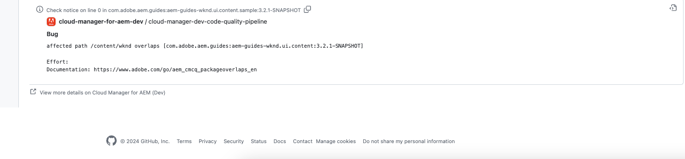

# GitHub檢查附註 {#github-annotations}

瞭解GitHub如何檢查私人存放庫的註釋PR，以向您提供有用的意見回饋。

## 概觀 {#overview}

如果您的Cloud Manager程式使用[私人存放庫](private-repositories.md)，系統會自動針對每個提取請求執行GitHub簽入。 這些檢查會附上有用資訊的註釋，以協助您儘快瞭解程式碼的任何問題。

[SonarQube](/help/using/custom-code-quality-rules.md) 檢測到的[程式碼品質](/help/using/code-quality-testing.md)問題會清楚列出。

系統會提供出現問題的確切程式碼，您可以按一下以顯示相關程式碼。這些註解是針對所有程式碼問題提供的，而不只是提取請求中變更的問題。

所有附註行都彙總在 GitHub 拉取請求的「**已更改檔案**」索引標籤上。提取請求中未更改的檔案附註會顯示在檔案所屬的部分中。

## 計畫碼品質管道 {#code-quality-pipelines}

[程式碼品質](/help/using/code-quality-testing.md)結果也會顯示在管道中，Cloud Manager會在&#x200B;**檢查**&#x200B;索引標籤底部自動觸發該管道。 這也可以從提取請求的檢查「**詳情**」中存取。

您也可以在 CSV 表單中以視覺化呈現問題。[檢視Cloud Manager](/help/using/managing-pipelines.md)中管道執行的詳細資訊，即可擷取此方法。
