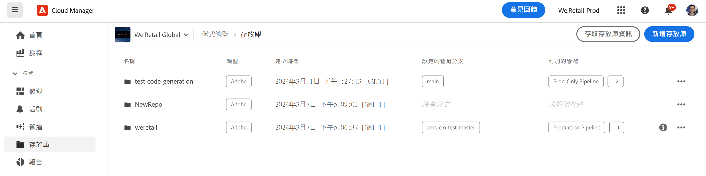
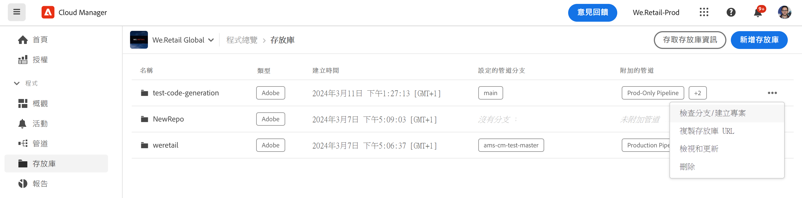
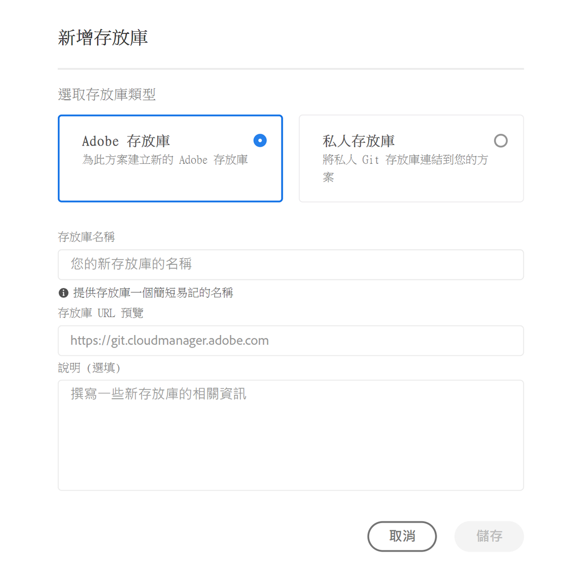
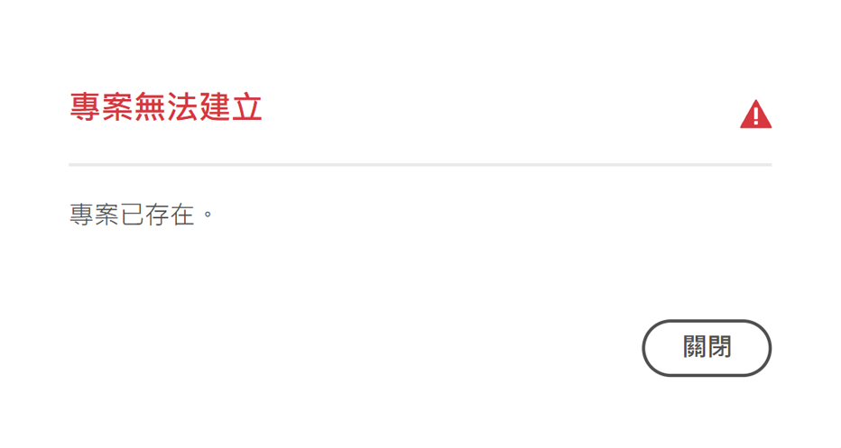
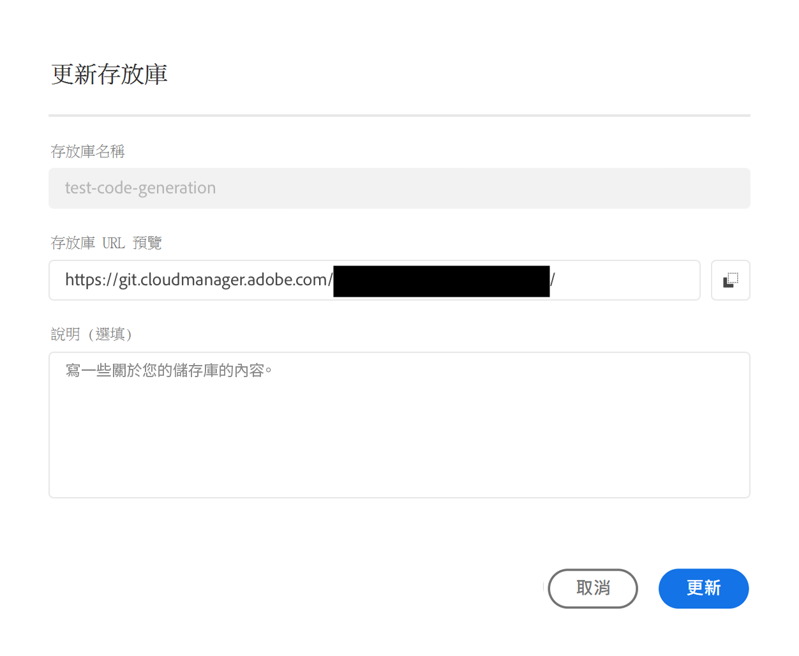
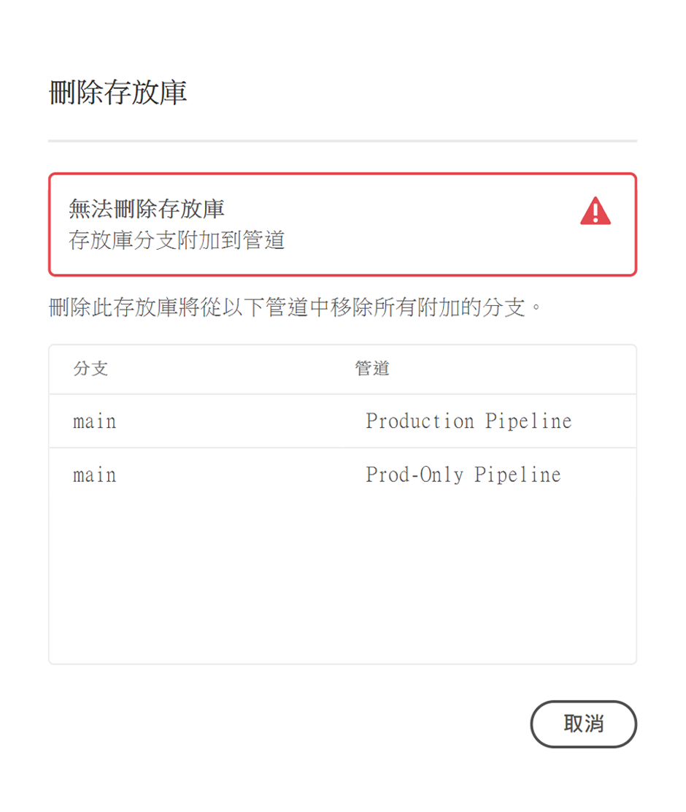

# Cloud Manager 存放庫 {#cloud-manager-repos}

了解如何在 Cloud Manager 中建立、檢視和編輯 Git 存放庫。

## 概觀 {#overview}

存放庫是用來使用 Git 儲存和管理專案的程式碼。您在 Cloud Manager 中建立的每項方案都有一個為其建立的 Adob&#x200B;&#x200B;e 託管存放庫。

您可以選擇建立其他 Adob&#x200B;&#x200B;e 管理存放庫，也可以新增您自己的私人存放庫。所有與您方案有關聯的存放庫都可以在「**存放庫**」視窗中查看。

在新增或編輯管道時，您也可以選擇在 Cloud Manager 中建立的存放庫。如需更多資訊，請參閱 [CI-CD 管道](/help/overview/ci-cd-pipelines.md)。

任何指定管道都有一個主要存放庫或一個分支。透過[Git 子模組支援](git-submodules.md)，可以在建置階段包含許多次要分支。

## 存放庫視窗 {#repositories-window}

1. 在 [my.cloudmanager.adobe.com](https://my.cloudmanager.adobe.com/) 登入 Cloud Manager 並選取適當的組織和方案。

1. 從「**方案概觀**」頁面，選取「**存放庫**」索引標籤，然後切換至「**存放庫**」頁面。

1. 「**存放庫**」視窗會顯示與您的方案有關聯的所有存放庫。

   

「**存放庫**」視窗會提供有關存放庫的詳細資訊：

* 存放庫類型
   * **Adobe** 表示 Adob&#x200B;&#x200B;e 託管的存放庫
   * **GitHub** 表示您管理的私人GitHub存放庫
* 當存放庫建立時
* 與存放庫有關聯的管道

您可以在視窗中選取存放庫，然後按一下省略號按鈕，對所選存放庫執行操作。

* **[檢查分支/建立專案](#check-branches)** (僅適用於 Adob&#x200B;&#x200B;e 存放庫）
* **[複製存放庫 URL](#copy-url)**
* **[檢視和更新](#view-update)**
* **[刪除](#delete)**

## 新增存放庫 {#adding-repositories}

點選或按一下「**存放庫**」視窗中的「**新增存放庫**」按鈕，以啟動「**新增存放庫**」精靈。

Cloud Manager 會支援 Adobe 託管的存放庫 (**Adobe 存放庫**) 以及您自己管理的存放庫 (**私人存放庫**)。必填欄位會根據您選擇新增的存放庫類型而有所不同。參閱以下文件，了解更多詳細資訊。

* [在 Cloud Manager 中新增 Adob&#x200B;&#x200B;e 存放庫](adobe-repositories.md)
* [在 Cloud Manager 中新增私人存放庫](private-repositories.md)

>[!NOTE]
>
>* 使用者必須具備&#x200B;**部署管理員**&#x200B;或&#x200B;**業務負責人**&#x200B;角色才能新增存放庫。
>* 任何指定公司或 IMS 組織中的所有計畫都存在 300 個存放庫的限制。

## 存取存放庫資訊 {#repo-info}

在「**存放庫**」視窗中查看存放庫時，您可以點選或按一下工作列的「**存取存放庫資訊**」按鈕，以查看有關如何以程式設計方式存取 Adobe 託管的存放庫的詳細資訊。

「**存放庫資訊**」視窗會開啟，並且內含詳細資訊。有關存取存放庫資訊的更多資訊，請參閱文件[「存取存放庫資訊」。](accessing-repositories.md)

## 檢查分支 {#check-branches}

此 **檢查分支/建立專案** 動作會根據存放庫狀態執行兩個功能。

* 如果存放庫是新建立的，動作會根據下列專案建立範例專案 [AEM專案原型。](https://experienceleague.adobe.com/en/docs/experience-manager-core-components/using/developing/archetype/overview)
* 如果存放庫已建立範例專案，則會檢查存放庫及其分支的狀態，並報告範例專案是否已存在。

## 複製存放庫 URL {#copy-url}

「**複製存放庫 URL**」操作會將「**存放庫**」視窗中所選的存放庫 URL 複製到剪貼簿以用在其他地方。

## 檢視和更新 {#view-update}

「**查看與更新**」操作會開啟「**更新存放庫**」對話框。使用此操作時，您可以查看&#x200B;**名稱**&#x200B;和&#x200B;**存放庫 URL 預覽**，以及更新存放庫的&#x200B;**說明**。

## 刪除 {#delete}

「**刪除**」操作會從您的專案中刪除存放庫。如果存放庫與管道有關聯，則無法刪除。

請注意，在 Cloud Manager 刪除存放庫時，它會被標記為已刪除，使用者無法再存取，但它會保留在系統中以用於恢復目的。

如果您在刪除同名存放庫後嘗試建立新存放庫，您將收到錯誤訊息 `An error has occurred while trying to create repository. Please contact your CSE or Adobe Support.`

如果您收到此錯誤訊息，請聯絡 Adobe 支援，如此他們可協助重新命名已刪除的存放庫，或為新的存放庫選擇不同的名稱。
