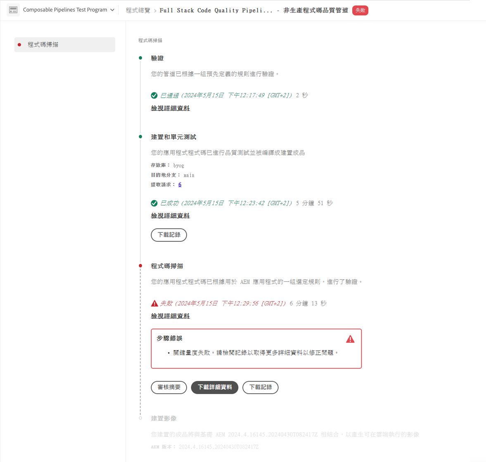

# 管理管道 {#managing-pipelines}

了解如何管理現有管道，包括將其編輯、執行和刪除。

## 管道卡 {#pipeline-card}

此&#x200B;**管道**&#x200B;卡位於 Cloud Manager 中的&#x200B;**方案總覽**&#x200B;頁面上，可讓您總覽您所有的管道及其目前狀態。

按一下每個管道旁邊的省略符號按鈕，您就可以執行下列操作：

* [執行管道](#running-pipelines)。
* [編輯管道](#editing-pipelines)。
* [刪除管道](#deleting-pipelines)。
* [檢視詳細資料](#view-details)。

在管道清單底部，您有以下一般選項。

* **新增** — 至[新增生產管道](/help/using/production-pipelines.md)或[新增非生產管道](/help/using/non-production-pipelines.md)。
* **全部顯示** — 將使用者帶至&#x200B;**管道**&#x200B;畫面，在更詳細的表格中檢視所有管道。
* **存取存放庫資訊** — 顯示存取Cloud Manager Git存放庫所需的資訊。
* **了解更多** - 瀏覽至 CI/CD 管道文件資源。

## 管線視窗 {#pipelines}

**管道**&#x200B;視窗顯示所選方案所有管道的完整清單。此清單非常有用，因為它提供的資訊比[管道卡](#pipeline-card)中可用的資訊更全面。

1. 在 [my.cloudmanager.adobe.com](https://my.cloudmanager.adobe.com/) 登入 Cloud Manager 並選取適當的組織和方案。

1. 從&#x200B;**方案總覽**&#x200B;頁面，按一下&#x200B;**管道**&#x200B;索引標籤以切換至&#x200B;**管道**&#x200B;視窗。

1. 在這裡，您可以看到方案的所有管道清單，並像在&#x200B;**管道卡**&#x200B;中一樣開始和停止管道執行。

按一下`i`圖示會顯示有關管道上次或目前執行的詳細資料。

按一下「**檢視詳細資料**」即可前往管道執行的[詳細資料](#view-details)。

## 活動視窗 {#activity}

這&#x200B;**活動**&#x200B;視窗顯示所選方案所有管道執行的完整清單。

1. 在 [my.cloudmanager.adobe.com](https://my.cloudmanager.adobe.com/) 登入 Cloud Manager 並選取適當的組織和方案。

1. 從&#x200B;**方案總覽**&#x200B;頁面，按一下&#x200B;**活動**&#x200B;索引標籤以切換至&#x200B;**活動**&#x200B;視窗。

1. 在這裡，您可以看到方案所有管道執行的清單，包括目前和歷史執行。

按一下`i`圖示會顯示所選管道執行執行的詳細資訊。

按一下&#x200B;**檢視詳細資料**&#x200B;以檢視管道執行的[詳細資料](#view-details)。

## 執行管道 {#running-pipelines}

1. 在 [my.cloudmanager.adobe.com](https://my.cloudmanager.adobe.com/) 登入 Cloud Manager 並選取適當的組織和方案。
1. 從&#x200B;**方案總覽**&#x200B;頁面瀏覽至&#x200B;**管道**&#x200B;卡。
1. 按一下您執行的管道旁的省略符號按鈕，然後從功能表中選取&#x200B;**執行**。

   狀態列會指出管道執行何時開始。

   您可以查看執行的詳細資訊，只要再按一下省略符號按鈕，並選取 **[檢視詳細資訊](#view-details)**。

   依管道的類型而定，您也許可以取消執行，只要再按一下省略符號按鈕，並選取&#x200B;**取消**。

## 編輯管道 {#editing-pipelines}

1. 在 [my.cloudmanager.adobe.com](https://my.cloudmanager.adobe.com/) 登入 Cloud Manager 並選取適當的組織和方案。

1. 瀏覽至&#x200B;**管道**&#x200B;卡（位於&#x200B;**方案總覽**&#x200B;頁面），並按一下您要編輯的管道旁的省略符號按鈕，然後從功能表中選取&#x200B;**編輯**。

1. **編輯生產管道**&#x200B;或&#x200B;**編輯非生產管道**&#x200B;對話方塊就會顯示。 您可以編輯在管道建立期間輸入的相同細節。

   如需有關管道可用的欄位和組態選項的詳細資訊，請參閱[設定生產管道](/help/using/production-pipelines.md)和[設定非生產管道](/help/using/non-production-pipelines.md)。

1. 完成時，按一下&#x200B;**更新**。

>[!NOTE]
>
>您無法編輯執行中的管道。

## 刪除管道 {#deleting-pipelines}

1. 在 [my.cloudmanager.adobe.com](https://my.cloudmanager.adobe.com/) 登入 Cloud Manager 並選取適當的組織和方案。

1. 瀏覽至&#x200B;**管道**&#x200B;卡（從&#x200B;**方案總覽**&#x200B;頁面），並按一下您執行的管道旁的省略符號按鈕，然後從功能表中選取&#x200B;**刪除**。

>[!NOTE]
>
>您無法刪除執行中的管道。

## 檢視詳細資訊 {#view-details}

1. 在 [my.cloudmanager.adobe.com](https://my.cloudmanager.adobe.com/) 登入 Cloud Manager 並選取適當的組織和方案。

1. 瀏覽至&#x200B;**管道**&#x200B;卡（從&#x200B;**方案總覽**&#x200B;頁面），並按一下您執行的管道旁的省略符號按鈕，然後從功能表中選取&#x200B;**檢視詳細資料**。

1. 系統將會帶您前往執行中管道的詳細資訊頁面。

從這裡，您可以檢視管道各個步驟的狀態並擷取組建記錄以進行診斷。  如需詳細資訊，請參閱文件：[程式碼部署](/help/using/code-deployment.md)。

管道執行中的所有步驟都會顯示，尚未開始的步驟會顯示為灰色。已完成的步驟會顯示其持續時間。

管道步驟完成時，會顯示摘要。

按一下&#x200B;**檢視詳細資料**&#x200B;連結以顯示&#x200B;**持續時間**&#x200B;區段。 此區段包含根據該計畫歷史趨勢的管道平均持續時間。

如果您的管道包含&#x200B;**程式碼掃描**&#x200B;步驟而發生問題，您可以按一下&#x200B;**下載詳細資料**&#x200B;按鈕，以檢視未通過的[程式碼品質測試](/help/using/code-quality-testing.md)清單。

CSV 檔案中有「**專案檔案位置**」欄，會指出違規程式碼的位置。此欄是專案相對路徑，而「**檔案位置**」欄是 Maven 產生。

>[!NOTE]
>
>您只能查看正在執行或已執行至少一次的管道的詳細資訊。
